<h1 align="center">Kinetrace</h1>

<p align="center">
  <strong>Haz tus ejercicios de fisioterapia en casa, con un entrenador que te ve.</strong><br/>
  <em>Do your physio exercises at home, with a coach that can see you.</em>
</p>

<p align="center">
  
</p>

Kinetrace turns a phone or laptop camera into a rehabilitation coach. It recognises
your body with an on-device pose model, counts repetitions, times holds, measures
range of motion, corrects your form with short spoken cues, and keeps a history for
every member of the family.

**Everything runs in the browser. Video never leaves the device, and there is no
account.** What is stored is skeletons, angles and counts — never pixels.

> Kinetrace runs the plan a professional gave you. It is not a medical device, it
> does not diagnose, and it does not replace your physiotherapist. The ranges that
> ship with the library are defaults; your physio's numbers replace them.

---

## What it does

- **Counts and times.** A repetition state machine over smoothed joint angles, with
  hysteresis and dwell times, so jitter never counts and a short repetition is
  reported as a partial rather than silently accepted.
- **Corrects, gently.** One cue at a time, under six words, always saying what to do
  ("lift your hips", not "your hips are low"), with cooldowns and safety first.
- **Works from three metres away.** Big numbers, spoken cues, gestures — both
  wrists above your head pauses, waving one hand skips — and, if you turn them on,
  voice commands: say "pausa", "sigue", "siguiente" or "repite" from the mat.
  Whisper runs on the device through WebGPU; the audio never leaves it, and it is
  not the Web Speech Recognition API, which in most browsers does not run locally.
- **Made for the person who prescribed it.** A physiotherapist can go through the
  routine exercise by exercise — what is measured and how reliably, the range to aim
  for, the point at which the session stops, the dosage, which way each exercise
  loads the lower back, and the exact words the app will say — adjust it and sign. The numbers are checked as they are typed, including
  against how the engine counts, so a target that has quietly stopped meaning anything
  is caught before it reaches anybody.
- **Shows you the exercise first.** Before an exercise you have not done, the app
  says how it is done a step at a time and animates a figure doing it, built from
  the exercise's own reference motion. It gets out of the way: once you have done
  it, after your first three sessions, or the moment you say you know it — and
  settings takes that back.
- **Works without the camera.** Sometimes the phone cannot be propped up. The
  guided mode counts the session out loud instead — the pace, the repetitions, and
  the movements themselves ("sube", "baja", "redondea", "arquea"), with the figure
  moving to the same clock. It measures nothing, and every set it records says so:
  no percentage in the summary, out of the range in the report, out of the progress
  chart entirely. The pace is not invented either — it comes from the duration each
  exercise declares for one repetition of its reference motion, or from a
  prescribed tempo where there is one.
- **Remembers without watching.** Sessions store a 15 fps skeleton track you can
  replay and compare — around 2 kB per second, and no video anywhere.
- **Reads your physio's sheet.** Photograph it and Kinetrace proposes a routine,
  with every mapping shown for review before anything is saved.
- **Explains itself.** A help screen generated from the library and the engine
  rather than written beside them: the gestures performed by the same figure the
  session draws, the recogniser's own vocabulary, every camera placement the library
  uses, and — word for word — what the setup assistant says while it is blocking a
  session. The introduction can be watched again from there at any time.
- **Spanish and English**, UI and cues.

## Try it

```bash
pnpm install
pnpm models:fetch   # self-host the pose models (about 45 MB)
pnpm dev
```

Open the app, create a profile, and press Start. Everything works offline after the
first load; it installs as a PWA.

## How it works

```
camera ─▶ MediaPipe Pose (main thread, requestVideoFrameCallback)
             │ 33 landmarks, world + image
             ▼
        One Euro filter ─▶ metrics ─▶ repetition machine / hold timer   ┐
                              │            │                           │ worker
                              └─▶ form rules ─▶ cue scheduler ─▶ cue    ┘
                                                   │
                                        screen + speech synthesis
```

The engine never sees pixels: it consumes landmark frames and produces numbers,
events and cue keys. That is why the same code runs in the browser, in a worker, and
in Node for the replay tool and the tests.

| Package                                    | What lives there                                                                                                                                                            |
| ------------------------------------------ | --------------------------------------------------------------------------------------------------------------------------------------------------------------------------- |
| [`packages/engine`](packages/engine)       | Filtering, metrics, repetition machine, hold timer, rules, cue scheduler, gestures, the voice grammar matcher, setup assistant, skeleton tracks. Framework-free TypeScript. |
| [`packages/exercises`](packages/exercises) | The exercise DSL, its validator, the Spanish and English cue dictionary and voice vocabulary, the spoken script for a session with no camera, and the starter library.      |
| [`packages/import`](packages/import)       | The sheet import pipeline, with OCR and language models behind swappable interfaces.                                                                                        |
| [`apps/web`](apps/web)                     | The PWA: profiles, library, routine builder, session, progress, settings.                                                                                                   |
| [`scripts/replay`](scripts/replay)         | Run the engine over a fixture and print the trace, with no camera.                                                                                                          |

## Add an exercise

Exercises are **data**, not code. One file, no engine changes:

```ts
export const gluteBridge: ExerciseDefinition = {
  id: 'glute-bridge',
  names: { es: 'Puente de glúteos', en: 'Glute bridge' },
  metrics: { hip: { id: 'hipFlexion', side: 'auto' } },
  primaryMetric: 'hip',
  mode: 'reps',
  phases: [
    { id: 'rest', when: { below: 140 }, minDwellMs: 200 },
    { id: 'top', when: { above: 148 }, minDwellMs: 500 },
  ],
  targets: { direction: 'increase', band: { min: 165, max: 185 } },
  rules: [/* conditions over metrics, with a cue key and a cooldown */],
  // How it is done, for the person about to do it. Required, and checked:
  // an exercise nobody can explain has no business being prescribed.
  howTo: { es: ['Túmbate boca arriba…'], en: ['Lie on your back…'] },
  // What the lumbar spine is asked to do while this happens.
  spinalLoad: 'neutral',
  // …
};
```

Then check it without a camera:

```bash
pnpm fixtures:build
pnpm replay glute-bridge --metrics
```

The full guide is in [CONTRIBUTING.md](CONTRIBUTING.md).

## Deploying

The app is static, so any host works. Two layouts are supported and both are
tested in CI:

- **Served from the root** (Vercel, a custom domain). `vercel.json` is set up
  for it: `pnpm build`, output in `apps/web/dist`.
- **Served from a subdirectory** (GitHub Pages project site, at
  `https://<user>.github.io/kinetrace/`). `.github/workflows/pages.yml` builds
  and deploys it on every push to `main`; the base path comes from the Pages
  configuration, so forks and custom domains work without editing anything.
  Enable it once under **Settings → Pages → Source: GitHub Actions**.

Runtime paths — the pose models and the MediaPipe runtime — go through
`assetUrl()` rather than being absolute, and the build writes a `404.html`
copy of the app so deep links work on hosts without rewrites.

The built site is about 97 MB, most of it the pose models and the MediaPipe
runtime. That is inside the GitHub Pages size limit, but its bandwidth
allowance is a soft 100 GB per month, so a widely shared install is happier on
a host with more headroom.

## Privacy

- Camera frames are processed in memory and dropped. Nothing is recorded.
- No account, no server, no analytics. The only network traffic is the app itself
  and the models.
- Pose models are self-hosted in the app. The optional sheet import models are
  downloaded on demand, with their size shown first.
- Skeleton tracks are pruned after 90 days by default, and you can turn them off.

## Status

Milestone M0 (engine on fixtures) and M1 (the session) are in place: the engine is
tested against landmark fixtures for every exercise in the library, and the app runs
a full routine. Sheet import is the P1 flow described in the specification, with the
lexical matcher always available and the local language model optional.

The demo above is generated from the library's own reference motion; a recording of a
real session replaces it once the default ranges have been reviewed by a
physiotherapist.

## Licence

[MIT](LICENSE). Model licences are listed in the About screen and in
[docs/models.md](docs/models.md).
